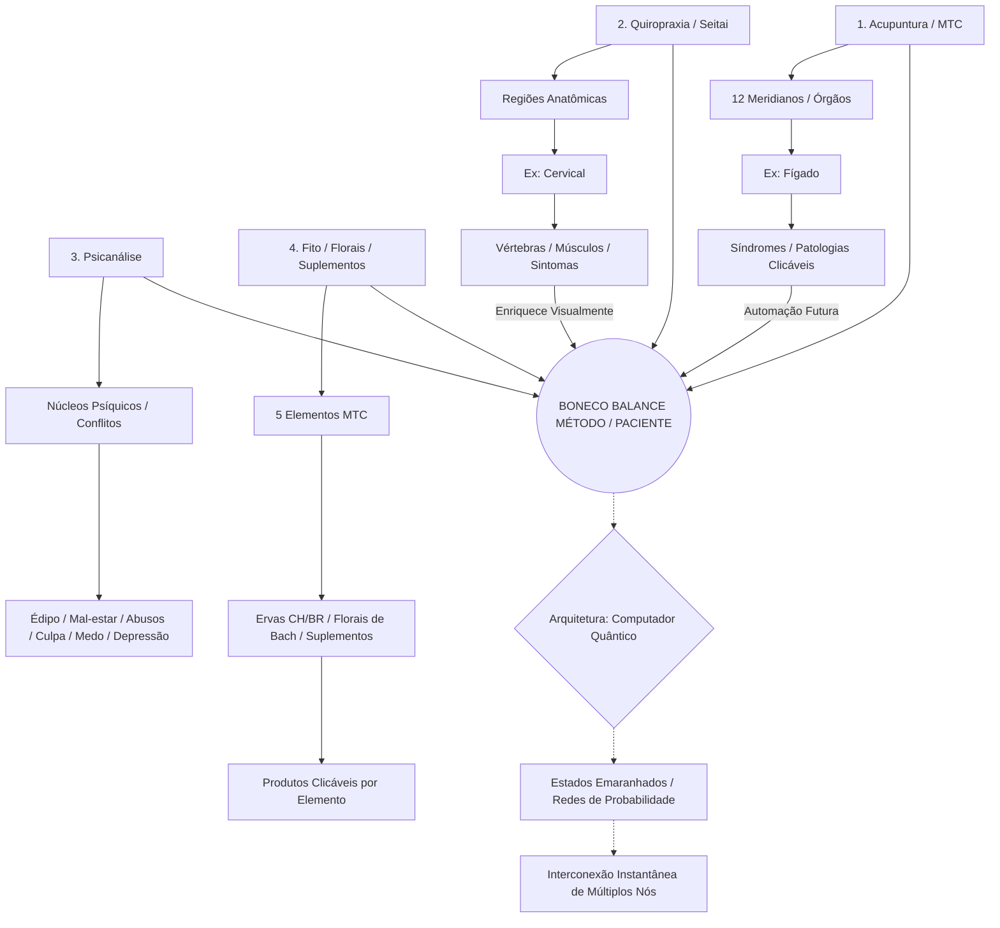

# 🌌 BÚSSOLA HOLOGRÁFICA DE CURA INTEGRATIVA
*O Gênesis da Plataforma: Conectando a Consciência, a Ciência e os Grafos Quânticos*

> "I AM THAT, I AM. Somos todos feitos da mesma matéria estelar, expressões diferentes da mesma consciência que organiza o universo."

---

## 1. O PARADIGMA VISUAL DO SISTEMA (BAGUA CLÍNICO)

A interface opera como uma malha holográfica interconectada. O todo está contido em cada pequena parte, orbitando o núcleo central do paciente.



## 2. FILOSOFIA DE ARQUITETURA: COMPUTADOR QUÂNTICO VS. DISCO RÍGIDO

A informação clínica neste software não fica presa a "pastas isoladas" ou registros rígidos e lineares. O sistema mimetiza o funcionamento da Computação Quântica e a Superposição de Estados:

- Os sintomas físicos, os desequilíbrios bioenergéticos, os bloqueios arquetípicos e os traumas psíquicos coexistem em um estado de emaranhamento.
- Colapso da Função de Onda: Quando o terapeuta registra um diagnóstico específico (ex: um trauma de infância na Psicanálise), o sistema instantaneamente ilumina e altera múltiplos nós correlacionados na rede (o elemento correspondente na MTC, a vértebra somato-emocional na Quiropraxia, o nó correspondente na Árvore da Vida e o Chakra no corpo vibracional).

## 3. PROMPT MESTRE ABSOLUTO PARA O CLAUDE CODE

Copie o bloco de texto abaixo na íntegra e envie na sua ferramenta do Claude Code junto com os arquivos de imagem para gerar o núcleo estrutural e seguro do seu sistema.

```
Atue como Arquiteto de Software Principal, Especialista em Cibersegurança e Engenheiro de UI/UX Sênior. Vamos construir a fundação de uma plataforma clínica altamente confidencial e revolucionária batizada de "Bússola Holográfica de Cura Integrativa". O sistema integra MTC (Balance Method), Quiropraxia, Psicanálise, Terapias Vibracionais e Kabbalah Hermética, baseada em SVGs dinâmicos (conforme especificações visuais de image_ec0724.png e Triagrama_montgomery.jpg).

### 1. ARQUITETURA DE DADOS: O PARADIGMA DO COMPUTADOR QUÂNTICO
- Afaste-se da lógica tradicional de banco de dados rígido (estilo pastas/tabelas isoladas). O sistema deve funcionar sob a ótica da Computação Quântica: os sintomas, traumas e desequilíbrios físicos existem em um estado de "superposição" e "emaranhamento".
- Um único ponto de entrada (Ex: um trauma registrado na Psicanálise) deve alterar e iluminar instantaneamente múltiplos nós correlacionados: o elemento correspondente no Trigrama MTC, a vértebra somato-emocional na Quiropraxia, o Chakra no corpo vibracional e a Sefirá na Árvore da Vida.
- Modele os dados em Grafos Dinâmicos (TypeScript Interfaces) onde os nós se interconectam e reagem simultaneamente em tempo real.

### 2. SEGURANÇA ABSOLUTA & AUTENTICAÇÃO (PRIORIDADE ZERO)
Este sistema trata de propriedade intelectual única e dados clínicos extremamente sensíveis. Ninguém pode ter acesso sem autorização estrita.
- **Autenticação Segura:** Implemente o fluxo de login utilizando OAuth2 com "Sign in with Google" (Logar com a Conta do Google) integrado a um sistema de gerenciamento de sessões seguro (JWT/Tokens criptografados).
- **Proteção de Dados:** Toda a estrutura de dados onde residem as fichas clínicas dos pacientes e os mapeamentos de grafos deve ser protegida por regras rígidas de acesso no backend (RLS - Row Level Security), garantindo que apenas o terapeuta proprietário autenticado possa acessar os dados.

### 3. INTERFACE VISUAL & FLUXO DE COMPONENTES SVG
Toda a aplicação é construída com ícones e mapas estruturais em SVG manipulados dinamicamente via estado (mantendo a linguagem limpa exposta em image_ec0724.png).
- **Núcleo Central Intercambiável:** O círculo central (onde hoje fica o boneco de plantão na image_ec0724.png) deve alternar suavemente através de um estado booleano entre o Boneco Anatômico (Stick Figure) e o símbolo clássico do Yin-Yang em SVG.
- **Roda do Trigrama Montgomery:** Uma estrutura em grafos interconectada baseada nas 24h do Relógio Organométrico e nos eixos de meridianos (Ex: conexões diretas do IG para P, E, F, R demonstradas no Triagrama_montgomery.jpg). Ao registrar um desequilíbrio, as ramificações e os membros correspondentes nos bonecos inferiores (tags <path>/<circle> do SVG) devem acender ou mudar de cor dinamicamente.

### 4. CAMADAS CONCÊNTRICAS & CLUSTERS MODULARES
- **Módulo 1: Acupuntura & Balance Method:** Mapeamento dos 12 meridianos e síndromes clicáveis que calculam automaticamente o melhor sistema de balanço.
- **Módulo 2: Quiropraxia & Seitai:** Mapeamento da coluna vertebral integrado de forma somato-emocional aos meridianos do Trigrama.
- **Módulo 3: Psicanálise & Terapias Vibracionais:** Foco em patologias psicossomáticas profundas (depressão, traumas, abusos, culpa).
  - **Feature Toggle (Modo Oculto):** Crie um interruptor de configuração discreto ("Modo Vibracional"). Quando DESATIVADO, as menções a Reiki e Chakras ficam completamente ocultas da interface (mantendo a neutralidade médica do software). Quando ATIVADO, as camadas de Chakras emergem e se conectam às emoções da psicanálise e aos elementos.
- **Módulo 4: Fitoterapia, Florais & Suplementos:** Gaveta visual segmentada e filtrada automaticamente pelos 5 Elementos da MTC.

### 5. COMPATIBILIDADE DE EXPANSÃO: A ÁRVORE DA VIDA (KABBALAH)
- Estruture o grafo para suportar uma expansão holográfica futura: a **Camada da Árvore da Vida**.
- As 10 Sefirot (Keter, Chochmah, Binah, Da'at, Chesed, Gevurah, Tiferet...) atuarão como nós arquetípicos emocionais profundos, cujos 22 caminhos de emaranhamento devem se interconectar logicamente com os canais biológicos (MTC) e psíquicos (Psicanálise) já existentes.

### REQUISITOS DE SAÍDA DO CÓDIGO:
1. Arquitetura de Autenticação configurada com as rotas de proteção para Login do Google.
2. Interfaces TypeScript estruturadas em Grafos (nós e arestas interdependentes) que unifiquem essa malha holográfica (Meridianos, Sefirot, Vértebras, Emoções, Produtos).
3. Código do componente central em SVG com a alternância Boneco/Yin-Yang e o controle de visibilidade (Toggle) do módulo oculto de Reiki/Chakras.
```
